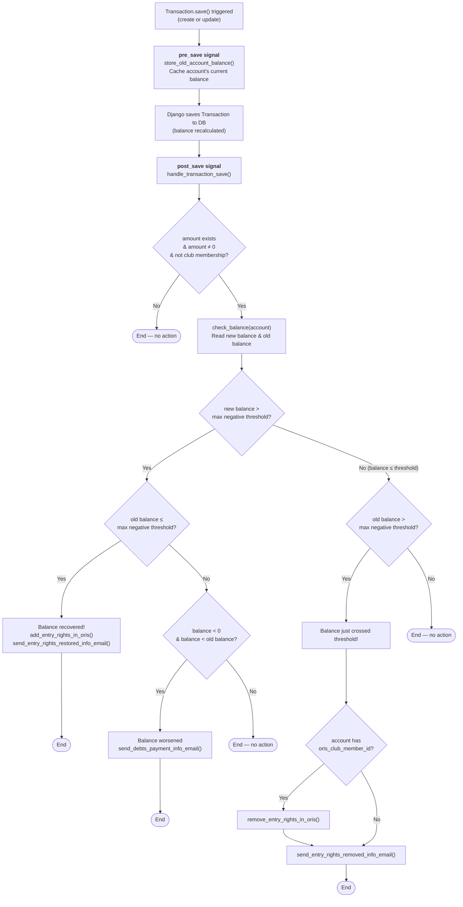

# Transaction Save Signal Flow

```mermaid
flowchart TD
    A["Transaction.save() triggered<br/>(create or update)"] --> B["<b>pre_save signal</b><br/>store_old_account_balance()<br/>Cache account's current balance"]
    B --> C["Django saves Transaction to DB<br/>(balance recalculated)"]
    C --> D["<b>post_save signal</b><br/>handle_transaction_save()"]
    D --> E{"amount exists<br/>& amount ≠ 0<br/>& not club membership?"}
    E -- No --> STOP([End — no action])
    E -- Yes --> F["check_balance(account)<br/>Read new balance & old balance"]
    F --> G{"new balance ><br/>max negative threshold?"}

    G -- Yes --> H{"old balance ≤<br/>max negative threshold?"}
    H -- Yes --> I["Balance recovered!<br/>add_entry_rights_in_oris()<br/>send_entry_rights_restored_info_email()"]
    I --> END1([End])

    H -- No --> J{"balance < 0<br/>& balance < old balance?"}
    J -- Yes --> K["Balance worsened<br/>send_debts_payment_info_email()"]
    J -- No --> END2([End — no action])
    K --> END3([End])

    G -- "No (balance ≤ threshold)" --> L{"old balance ><br/>max negative threshold?"}
    L -- Yes --> M["Balance just crossed threshold!"]
    M --> N{"account has<br/>oris_club_member_id?"}
    N -- Yes --> O["remove_entry_rights_in_oris()"]
    O --> P["send_entry_rights_removed_info_email()"]
    N -- No --> P
    P --> END4([End])
    L -- No --> END5([End — no action])
```
